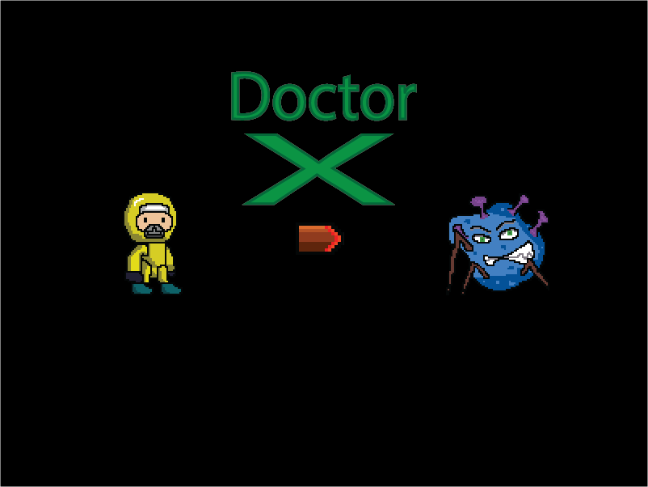

# Doctor X

## 🕹️ Overview
Doctor X is a 2D jump-and-run game where the player takes on the role of Doctor X, battling against viruses that have spread across a deserted village. Doctor X uses a magical powder to destroy the viruses, gaining points as he progresses through 5 levels. The goal is to reach the tower at the end of each level and ultimately save the village.

### 🎮 Game Features:
- **Five Levels**: Each level presents increasing challenges as the player progresses.
- **Main Character**: Doctor X, dressed in a yellow suit and wearing a mask, can run, jump, shoot, and collect coins.
- **Enemies**: Viruses are the antagonists, animated in blue with legs, constantly attempting to infect.
- **Pixel Art**: The game uses custom-designed pixel art created with **Adobe Photoshop** and **Aseprite**.
- **Weather**: The weather remains sunny throughout, contributing to the cheerful, albeit challenging, atmosphere.

## 🛠️ Technologies Used:
- **Game Engine**: Phaser
- **Programming Language**: JavaScript
- **Graphics**: Adobe Photoshop, Aseprite
- **Map Creation**: Tiled Map Editor

## 📜 Story:
The game is inspired by the global battle against viruses during the pandemic. Set in an abandoned village, Doctor X invents a magical powder to fight the virus monsters. The goal is to collect as many points as possible while advancing through different levels to reach a tower at the end of each stage.

## 🎨 Graphics:
- **Main Character**: Doctor X is a custom-designed sprite wearing a yellow suit and mask.
- **Enemies**: Virus monsters, colored blue with legs, animated to move and chase the player.
- **Maps**: Designed using **Tiled Map Editor**, with various terrain, obstacles, and background mountains.
- **Pixel Art**: All graphics are in pixel-art style, with sprites and animations created at 64x64 and 32x32 pixel frames.

## 🎮 Controls:
- **Left/Right Arrow**: Move left or right
- **Up Arrow**: Jump
- **Shift**: Run
- **Space**: Shoot magical powder

## 📊 Score System:
- Players earn points by shooting viruses and collecting coins.
- Progress is saved at each level, and the player’s score increases based on their actions.

## 🎥 Demo
- Watch the project in action: [YouTube Link](https://www.youtube.com/watch?v=CaZKJvPybPQ)
